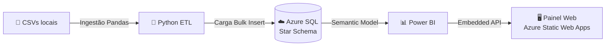
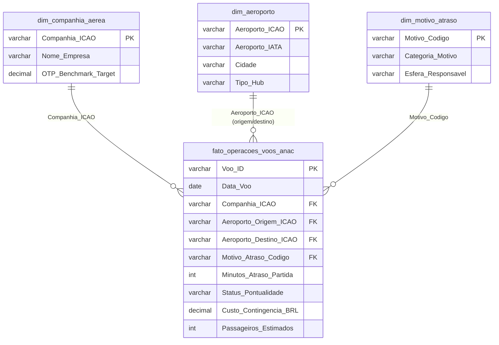

<div align="center">


# ✈️ Gestão de Risco Operacional, Pontualidade de Voos (OTP D15) e Custos da Resolução ANAC 400

**Pipeline de dados em nuvem (Python → Azure SQL → Power BI) para arbitrar o impasse entre Operações e Finanças em uma crise de malha aérea.**


*Projeto final do Bootcamp de Análise de Dados • Generation Brasil*

🔗 **Painel online:** `[Inserir URL do Azure Static Web Apps]`

</div>

---

## 📑 Índice

1. [Visão Geral](#-visão-geral)
2. [Contexto do Negócio: O Dilema](#-contexto-do-negócio-o-dilema)
3. [Objetivos](#-objetivos)
4. [Arquitetura da Solução](#-arquitetura-da-solução)
5. [Modelo de Dados (Star Schema)](#-modelo-de-dados-star-schema)
6. [Tecnologias e Metodologias](#-tecnologias-e-metodologias)
7. [Análises em SQL](#-análises-em-sql)
8. [Principais Resultados e Insights](#-principais-resultados-e-insights)
9. [Painel Web e Dashboards](#-painel-web-e-dashboards)
10. [Modelagem DAX](#-modelagem-dax)
11. [Recomendações Estratégicas](#-recomendações-estratégicas)
12. [Pitch Executivo (Método STAR)](#-pitch-executivo-método-star)
13. [Estrutura do Repositório](#-estrutura-do-repositório)
14. [Roadmap](#-roadmap)
15. [Data Squad (Equipe)](#-data-squad-equipe)
16. [Referências](#-referências)

---

## 🎯 Visão Geral

Este projeto simula a atuação da equipe de **Inteligência de Dados do Centro de Controle Operacional (CCO)** da aviação comercial brasileira durante uma severa crise de pontualidade nos principais hubs do país (Congonhas, Guarulhos, Santos Dumont e Brasília).

A partir de dados de operações de voo da ANAC e dos códigos de atraso IATA, a equipe construiu um **pipeline de engenharia de dados (ETL)** que leva os dados de CSVs locais até um **banco dimensional no Azure SQL**, consumido por um **semantic model no Power BI** e distribuído em uma **aplicação web (SPA) em HTML/CSS** hospedada no **Azure Static Web Apps**.

> 💡 **Resultado central:** a narrativa de que os atrasos são "100% exógenos" não se sustenta. **47,62% dos minutos de atraso** decorrem de fatores internos, sob controle das companhias.

---

## 🧩 Contexto do Negócio: O Dilema

Uma frente fria severa derrubou o teto operacional de Congonhas (SBSP) e o CGNA/DECEA impôs restrições de fluxo no TMA-SP. A interrupção local durou menos de uma hora, mas o choque se propagou por toda a malha: aeronaves fora de posição, tripulações no limite de jornada da Lei do Aeronauta (Lei nº 13.475/2017) e milhares de passageiros perdendo conexões e demandando assistência material conforme a **Resolução ANAC nº 400**.

| Executivo | Posição | Argumento |
|---|---|---|
| 🧑‍✈️ **COO** (Operações) | Atrasos **100% exógenos** | Meteorologia adversa e gargalos estruturais do controle de espaço aéreo. |
| 💰 **CFO** (Finanças) | Falhas **internas e estruturais** | R$ 26,4 milhões drenados em assistência material, acomodação e cancelamentos. Aponta malha apertada, ausência de aeronaves de reserva e manutenção corretiva negligenciada. |

**Missão da equipe:** dissecar os dados, isolar as causas-raiz reais e propor ao Comitê Executivo um plano de ação fundamentado em evidências.

---

## 📌 Objetivos

- [x] Calcular o **On-Time Performance (OTP D15)** real de cada companhia e compará-lo às metas contratuais.
- [x] Construir o **Diagrama de Pareto** das causas de atraso, separando responsabilidade interna e exógena.
- [x] Mapear o **Efeito Cascata (Reactionary Delays)** e identificar os hubs que mais propagam atrasos.
- [x] Quantificar o **custo da Resolução ANAC 400** por gravidade de irregularidade.
- [x] Persistir o modelo dimensional em **nuvem (Azure SQL)** e disponibilizá-lo em um **painel web**.

---

## 🏗️ Arquitetura da Solução

O projeto adota um fluxo moderno de engenharia de dados, processando a volumetria de voos operacionais e ingerindo-a em um ambiente relacional em nuvem, o que garante a integridade dos indicadores de OTP e Resolução 400.



| Etapa | Camada | O que acontece |
|---|---|---|
| **1. Extração** | Python (Pandas e SQLite) | Leitura de CSVs estruturados e tratamento dos dados para ingestão em massa |
| **2. Armazenamento** | Azure SQL | Star Schema (1 fato e 3 dimensões) persistido na nuvem |
| **3. Distribuição** | Power BI + SPA | Camada semântica consumindo o Azure, com renderização em uma aplicação HTML/CSS hospedada no Azure Static Web Apps |

`[Insira a imagem do diagrama de arquitetura Aqui]`

---

## 🗄️ Modelo de Dados (Star Schema)

O modelo segue os padrões de **Ralph Kimball**: uma tabela fato central conectada a três dimensões por chaves primárias e estrangeiras.



### 📋 Tabela Fato: `fato_operacoes_voos_anac`

| Campo | Descrição |
|---|---|
| `Voo_ID` (PK) | Identificador único da operação de voo |
| `Data_Voo`, `Mes`, `Dia_Semana` | Atributos temporais para sazonalidade |
| `Companhia_ICAO` (FK) | Companhia aérea operadora |
| `Numero_Voo`, `Rota` | Código comercial da etapa e par origem-destino |
| `Aeroporto_Origem_ICAO` / `Aeroporto_Destino_ICAO` (FK) | Aeroportos de partida e chegada |
| `Partida_Prevista` | Horário aprovado no slot (HH:MM) |
| `Minutos_Atraso_Partida` | Diferença entre partida real e prevista (acima de 15 = D15 violado) |
| `Status_Pontualidade` | Pontual (D15), Atraso Leve, Moderado, Severo ou Cancelado |
| `Motivo_Atraso_Codigo` (FK) | Causa primária (padrão IATA/ANAC) |
| `Custo_Contingencia_BRL` | Custo regulatório sob a Res. ANAC 400 |
| `Passageiros_Estimados` | Passageiros a bordo do voo |

### 🧭 Dimensões

| Dimensão | Chave | Utilidade |
|---|---|---|
| `dim_companhia_aerea` | `Companhia_ICAO` | Cadastro das empresas e metas contratuais de OTP |
| `dim_aeroporto` | `Aeroporto_ICAO` | 11 hubs críticos e capacidade de slots |
| `dim_motivo_atraso` | `Motivo_Codigo` | Mapeia códigos IATA em esferas: Companhia, Infraestrutura/ATC e Força Maior/Clima |

---

## 🛠️ Tecnologias e Metodologias

### Stack

| Categoria | Ferramenta | Aplicação |
|---|---|---|
| 🐍 ETL | **Python** (Pandas e SQLite) | Ingestão, tratamento e preparação dos CSVs |
| ☁️ Banco de dados | **Azure SQL** | Persistência do Star Schema na nuvem |
| 🔎 Análise | **SQL / T-SQL** (CTEs e Window Functions) | Consultas analíticas dos desafios |
| 📊 BI | **Power BI** e **DAX** | Semantic model, medidas e dashboards |
| 🖥️ Front-end | **HTML, Tailwind CSS e JavaScript** | Painel web em formato SPA com abas |
| 🚀 Hospedagem | **Azure Static Web Apps** | Publicação da aplicação |

### Metodologias

| Metodologia | Finalidade |
|---|---|
| **Modelagem Dimensional (Kimball)** | Fato e dimensões com integridade referencial |
| **Diagrama de Pareto (80/20)** | Priorizar as causas de maior impacto |
| **Análise de Filas e Efeito Cascata** | Medir a propagação de atrasos entre etapas de voo |
| **OTP D15 (padrão IATA)** | Pontualidade com tolerância de até 15 minutos |

---

## 🔍 Análises em SQL

| # | Desafio | Técnicas | Pergunta de Negócio |
|---|---|---|---|
| 1 | **Ranking OTP D15 vs Meta** | `JOIN`, `CASE WHEN`, agregações | Qual companhia é mais pontual e qual o gap para a meta? |
| 2 | **Pareto de Causas de Atraso** | CTE, `SUM() OVER` | Quais causas concentram 80% dos minutos perdidos? |
| 3 | **Propagação em Cascata** | Filtro `CONEX`, `COUNT() OVER` | Quais aeroportos mais geram atrasos reacionários? |
| 4 | **Custo da Res. 400 por Gravidade** | Agregações por status | Quanto custa cada nível de irregularidade? |
| 5 | **Padrão Temporal Horário** | CTE, `LAG()` | Como o atraso se acumula ao longo do dia? |

<details>
<summary><b>📎 Exemplo: Pareto com Window Function (Desafio 2)</b></summary>

```sql
WITH pareto AS (
    SELECT m.Categoria_Motivo,
           m.Esfera_Responsavel,
           SUM(f.Minutos_Atraso_Partida) AS Minutos
    FROM fato_operacoes_voos_anac f
    JOIN dim_motivo_atraso m
      ON f.Motivo_Atraso_Codigo = m.Motivo_Codigo
    WHERE f.Status_Pontualidade NOT IN ('Pontual (D15)', 'Cancelado')
    GROUP BY m.Categoria_Motivo, m.Esfera_Responsavel
)
SELECT Categoria_Motivo,
       Esfera_Responsavel,
       Minutos,
       ROUND(SUM(Minutos) OVER (ORDER BY Minutos DESC) * 100.0
             / SUM(Minutos) OVER (), 2) AS Pareto_Acum_Pct
FROM pareto;
```

</details>

<details>
<summary><b>📎 Exemplo: Variação horária com LAG (Desafio 5, sintaxe T-SQL)</b></summary>

```sql
WITH h AS (
    SELECT CAST(LEFT(Partida_Prevista, 2) AS INT) AS Hora,
           COUNT(*) AS Voos,
           ROUND(AVG(CASE WHEN Minutos_Atraso_Partida > 0
                          THEN CAST(Minutos_Atraso_Partida AS DECIMAL(10,2))
                          ELSE 0 END), 2) AS Med_Atraso
    FROM fato_operacoes_voos_anac
    GROUP BY CAST(LEFT(Partida_Prevista, 2) AS INT)
)
SELECT Hora, Voos, Med_Atraso,
       ROUND(Med_Atraso - LAG(Med_Atraso, 1) OVER (ORDER BY Hora), 2) AS Delta_Min
FROM h;
```

</details>

---

## 📈 Principais Resultados e Insights

### 1️⃣ Ranking OTP D15: nenhuma companhia atingiu a meta

| Pos. | Companhia | OTP D15 | Cancelamento | Meta Contratual | Gap |
|:---:|---|:---:|:---:|:---:|:---:|
| 🥇 | **Azul** | 71,77% | 2,34% | 84% | -12,23 p.p. |
| 🥈 | **LATAM** | 69,46% | 2,69% | 82% | -12,54 p.p. |
| 🥉 | **Gol** | 66,28% | 3,08% | 78% | -11,72 p.p. |
| 4º | **Voepass** | 60,56% | 2,82% | 69% | -8,44 p.p. |

### 2️⃣ Pareto: o clima não explica tudo

| Classe | Causa | Minutos | % do Total | Esfera |
|:---:|---|---:|:---:|---|
| A | 🌧️ **CLIMA** | 30.254 | 31,02% | Exógena |
| A | 🔗 **CONEX** (efeito cascata) | 25.313 | 25,95% | Interna |
| A | 🔧 **MANUT / AOG** | 21.138 | 21,67% | Interna |

As três causas da **Classe A** somam **78,65%** dos minutos. **CONEX + MANUT = 47,62%** têm origem interna.

### 3️⃣ Efeito Cascata: Guarulhos como epicentro

| Aeroporto | Participação no Efeito Cascata Nacional |
|---|:---:|
| ✈️ **GRU** (Guarulhos) | **29,77%** (153 voos, 7.302 min, R$ 1,11 M em custos) |
| BSB (Brasília) | 13,04% |
| VCP (Campinas) | 13,04% |
| CGH (Congonhas) | 11,67% |
| CNF (Confins) | 9,14% |

### 4️⃣ Impacto Financeiro da Resolução ANAC 400

| Gravidade | Custo Total | Custo Médio por Voo |
|---|---:|---:|
| 🟡 Atrasos Moderados (46 a 120 min, alimentação) | R$ 11,2 M | R$ 12,6 mil |
| 🟠 Atrasos Severos (acima de 120 min, hospedagem) | R$ 5,3 M | R$ 39,8 mil |
| 🔴 Cancelamentos | R$ 9,9 M | R$ 61,4 mil |
| **💰 Total do sistema** | **R$ 26,41 M** | |

### 5️⃣ Padrão Temporal: efeito "bola de neve"

| Janela | OTP D15 | Atraso Médio |
|:---:|:---:|:---:|
| 🌅 06h | 84,2% | 5,1 min |
| 🌆 19h | 54,3% | 42,8 min |

---

## 🖥️ Painel Web e Dashboards

A camada de apresentação é uma **SPA em HTML, Tailwind CSS e JavaScript** com identidade visual institucional (logo ANAC) e duas abas:

| Aba | Conteúdo |
|---|---|
| 📊 **Dashboard** | Área dedicada ao relatório Power BI (iframe com Embedded API) |
| ℹ️ **Sobre o Projeto** | Documentação executiva: arquitetura de dados, "Linha de Esteira Operacional" animada e cards da equipe |

`[Insira a imagem do Painel Web Aqui]`

### Telas do relatório Power BI

| Tela | Foco |
|---|---|
| **1. Visão Executiva (C-Level)** | OTP D15 com semáforo, cancelamento, minutos de atraso e custo total da Res. 400; OTP real vs meta por companhia |
| **2. Diagnóstico de Causas (Pareto)** | Pareto combinado com corte em 80%, frequência vs severidade e horas por esfera responsável |
| **3. Malha, Hubs e Efeito Cascata** | Mapa dos 11 hubs, ranking de geradores de efeito dominó e curva horária de atraso |
| **4. Impacto Regulatório ANAC 400** | Custo médio por voo afetado, waterfall de custos e tabela de auditoria para subsídio jurídico (JEC) |

`[Insira a imagem do Dashboard da Tela 1 Aqui]`

`[Insira a imagem do Dashboard da Tela 2 Aqui]`

`[Insira a imagem do Dashboard da Tela 3 Aqui]`

`[Insira a imagem do Dashboard da Tela 4 Aqui]`

---

## 🧮 Modelagem DAX

As medidas seguem *Measure Branching*, com medidas-base alimentando medidas derivadas.

| Frente | Medidas Principais |
|---|---|
| 📦 **Volume e Regularidade** | `Total_Voos`, `Voos_Pontuais_D15`, `OTP_D15_Pct`, `Taxa_Cancelamento_Pct` |
| ⏱️ **Minutos e Atrasos** | `Minutos_Atraso_Total`, `Media_Minutos_Atraso`, `Voos_Efeito_Cascata`, `Indice_Cascata_Pct` |
| 💵 **Custos Resolução 400** | `Custo_Contingencia_Total_BRL`, `Passageiros_Impactados`, `Custo_Medio_Por_Passageiro_BRL` |
| 🚦 **Formatação Condicional** | `Cor_Alerta_OTP` (semáforo dinâmico) |

```dax
OTP_D15_Pct = DIVIDE([Voos_Pontuais_D15], [Total_Voos], 0)

Cor_Alerta_OTP =
SWITCH(TRUE(),
    [OTP_D15_Pct] >= 0.80, "#10B981",  -- Verde
    [OTP_D15_Pct] >= 0.70, "#F59E0B",  -- Amarelo
    "#EF4444"                          -- Vermelho
)
```

---

## 🚀 Recomendações Estratégicas

| Recomendação | Problema Endereçado | Evidência |
|---|---|---|
| ✈️ **Reserva tática de aeronaves** | Malha apertada e efeito cascata | CONEX = 25,95% dos minutos; GRU origina 29,77% da cascata |
| ⏳ **Buffer de 15 min em slots críticos** | Acúmulo de atraso ao longo do dia | OTP cai de 84,2% (06h) para 54,3% (19h) |
| 🔧 **Reforço da manutenção preventiva** | Imobilizações não programadas (AOG) | MANUT/AOG = 21,67% dos minutos |
| 🎯 **Foco nos hubs geradores** | Propagação sistêmica | GRU, BSB e VCP concentram mais de 55% da cascata |

> 📌 **Potencial estimado:** redução de até **R$ 14,8 milhões** em custos de assistência material e ganho de **7,2 p.p.** no OTP. É uma projeção baseada nos cenários do estudo, não um resultado realizado.

---

## 🎤 Pitch Executivo (Método STAR)

| Etapa | Narrativa |
|---|---|
| **🅢 Situação** | Atuamos no CCO da aviação comercial brasileira durante uma crise de pontualidade nos principais hubs (CGH e GRU), com mais de **R$ 26 milhões** em custos da Resolução ANAC 400 e forte atrito entre as diretorias de Operações e Finanças. |
| **🅣 Tarefa** | Construir uma arquitetura de dados robusta para diagnosticar a causa-raiz dos atrasos, medir o efeito cascata na malha e entregar um painel executivo com métricas de pontualidade internacional (OTP D15). |
| **🅐 Ação** | Construímos um pipeline **Python → Azure SQL → Power BI** com Star Schema em nuvem. Desenvolvemos consultas SQL com **CTEs e Window Functions** para o Pareto 80/20, provando que **47,6%** dos atrasos vinham de fatores internos (manutenção AOG e conexão), e não do clima. Criamos medidas DAX com semáforos dinâmicos e publicamos um painel web hospedado no **Azure Static Web Apps**. |
| **🅡 Resultado** | Desmistificamos a narrativa de que "a culpa era 100% do clima", identificamos **Guarulhos como origem de 29,8%** do efeito cascata nacional e propusemos **reserva tática de aeronaves** e **buffer de 15 minutos** em slots críticos, com potencial de reduzir **R$ 14,8 M** em custos e elevar o OTP em **7,2 p.p.** |

---

## 📁 Estrutura do Repositório

```
📦 projeto_anac
 ┣ 📄 index.html                                   # SPA (Tailwind CSS): aba Dashboard e aba Sobre o Projeto
 ┣ 🖼️ logo_anac.png                                # Identidade visual do painel
 ┣ 📊 GenFinalAd04.pbix                            # Relatório Power BI (versão final)
 ┣ 📊 Projeto Generation Brasil - Anac - V006.pbix # Versões do relatório (histórico: V001, V002, V006)
 ┗ 📄 README.md
```

---

## 🗺️ Roadmap

- [x] **Fase 1:** ETL em Python, modelagem Star Schema, carga no Azure SQL e relatório no Power BI
- [x] **Fase 1:** SPA institucional com documentação executiva e visão da equipe
- [ ] **Fase 2:** Integração do Power BI Embedded (inserir o `src` do relatório no iframe do painel)

---

## 👥 Data Squad (Equipe)

Projeto desenvolvido de forma colaborativa por 7 profissionais:

| Integrante | Papel | Competências |
|---|---|---|
| **Gabriel Vieira** | Lead Analytics Engineer | Azure SQL, Python |
| **Alef Reis** | Data Engineer | ETL Pipelines, T-SQL |
| **Evelin Lins** | BI Developer | Power BI, DAX |
| **Roberta Salyna** | Data Governance Analyst | Compliance, Data Catalog |
| **Anna Callejon** | Data QA & Doc | Data Quality, Testing |
| **Douglas Serafim** | ETL Developer | Pandas, SQL |
| **Luana Silva** | Data Product Manager | Scrum, Strategy |

> 🔗 LinkedIn dos integrantes: `[Inserir links]`

---

## 📚 Referências

- [ANAC: Resolução nº 400, de 13/12/2016](https://www.anac.gov.br/assuntos/legislacao/legislacao-1/resolucoes/resolucoes-2016/resolucao-no-400-13-12-2016)
- [Ministério dos Transportes: Análise de Pareto, o que é e para que serve](https://www.gov.br/transportes/pt-br/assuntos/portal-da-estrategia/artigos-gestao-estrategica/analises-de-pareto-o-que-e-e-para-que-serve)
- [Generation Brasil: Case 04, ANAC Operações de Voos](https://github.com/conteudoGeneration/proj-analista-dados/tree/main/case-04-anac-operacoes-voos)
- Lei nº 13.475/2017 (Lei do Aeronauta)

---

<div align="center">

**ANAC • Projeto Risco Operacional @ Generation 2026**

⭐ Se este projeto foi útil, deixe uma estrela no repositório!

</div>
